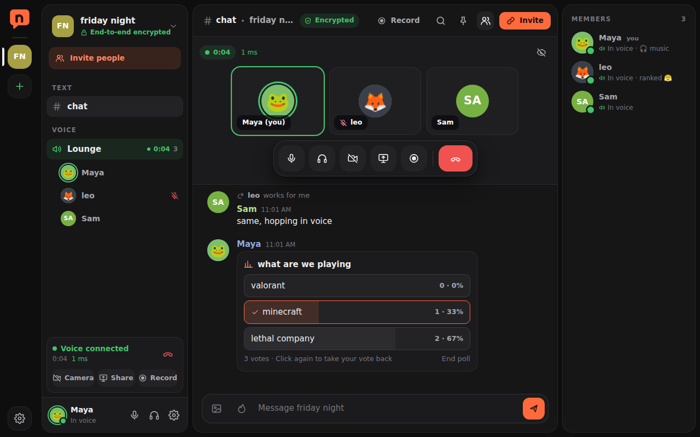
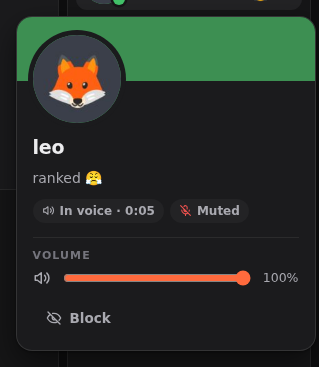
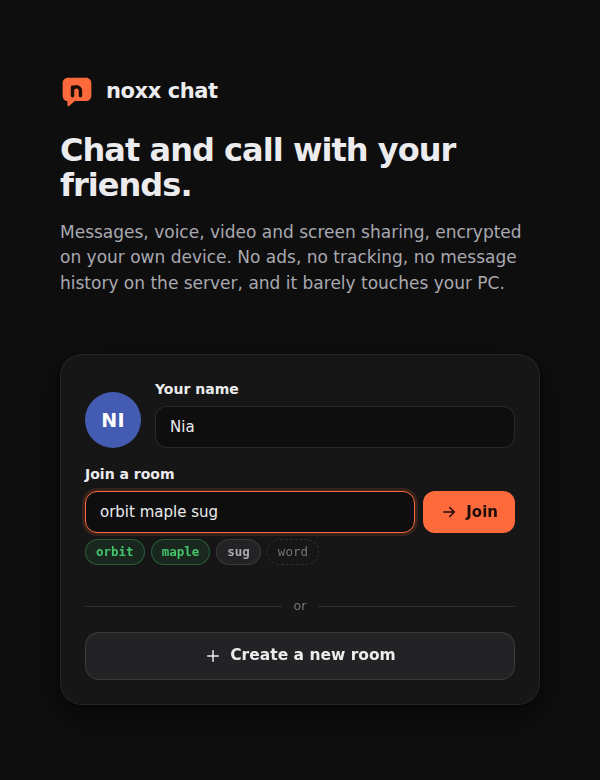
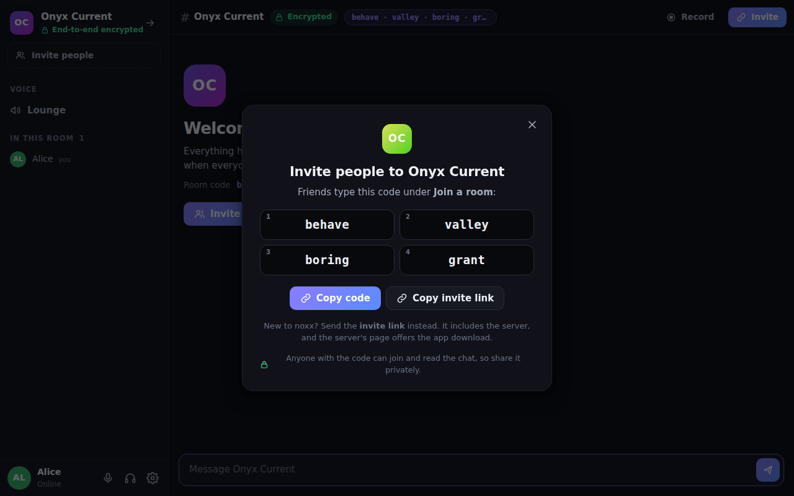

# noxx chat

Private chat, voice, video and screen sharing that doesn't eat your PC.

**[Download for Windows](https://github.com/Nox-Labs-x/N0xx-Chat/releases/latest/download/noxx-chat-setup-windows-x64.exe)** ·
[Mac](https://github.com/Nox-Labs-x/N0xx-Chat/releases/latest/download/noxx-chat-macos-arm64.dmg) ·
[Linux](https://github.com/Nox-Labs-x/N0xx-Chat/releases/latest/download/noxx-chat-linux-x64.deb) ·
[All releases](https://github.com/Nox-Labs-x/N0xx-Chat/releases)

I got tired of chat apps that sit at 500 MB of RAM doing nothing, so I made my own. The installer
is a few MB, it idles at basically 0% CPU, and in calls your graphics card does the video work
instead of your CPU.

It's end-to-end encrypted and messages aren't stored anywhere. Servers can have you sign in, so
people know it's really you, but even the server can't read what you say.

### Features

- Chat with replies, reactions, edits, spoilers and **disappearing messages**
- Voice with mute, deafen, **push to talk** (works while you're in a game), a call timer and
  per-person volume (right click someone)
- Notifications for @mentions (or every message, or none)
- Camera and screen sharing up to **1440p / 60 fps**, with stereo sound for games and music
- **Point at someone's shared screen.** Everyone watching sees your pointer and clicks.
  Scroll to zoom into a share.
- **Built-in screen recorder** (Windows) that saves straight to `Videos\noxx chat` and runs on
  your graphics card
- Profiles with a picture, colour, status and a short "about me"
- Rename rooms, switch between them from the side rail, pick your own accent colour
- Rooms use 4-word codes like `orbit maple sugar velvet` instead of long random links
- **Accounts on your server:** a verified @username, so nobody can pretend to be you. Whoever runs
  the server can make invite codes, remove people and reset passwords from inside the app

 

### Nobody can clip you

On Windows and Mac, the noxx chat window is hidden from screen recorders, clipping tools and
screen shares, including its own recorder. The recorder only captures your screen, your mic and your
computer's sound, never other people's voices or cameras. So what's said in noxx chat stays in
noxx chat.

(Nothing can stop someone holding a phone up to their speakers, but everything on the PC side is
covered.)

### Installing

**Windows:** run `noxx-chat-setup-windows-x64.exe`. It isn't code-signed yet, so Windows might show
"Windows protected your PC". Click *More info*, then *Run anyway*. No admin needed. Your settings
carry over from older versions, and you can uninstall the old "noxx" from *Settings → Apps*.

**Mac:** open the .dmg, drag noxx chat into Applications, then right-click it and pick *Open* the first time.

**Linux:** `sudo apt install ./noxx-chat-linux-x64.deb`. Chat works everywhere. Voice depends on your distro's WebKitGTK having WebRTC.

### Using it

1. Put in the server link you got from whoever runs your server (something like `https://noxx.tail1234.ts.net`).
   It goes green once it connects.
2. If the server uses accounts, sign in, or pick *Create account* (you might need an invite code
   from whoever runs it). Then pick a name, and a picture in *Settings → My profile* if you like.
3. Type a room code a friend sent you, or hit **Create a new room**. Codes don't care about capitals
   or spacing, and the first 4 letters of each word are enough.
4. In a room, **Invite → Copy invite** gives you a message with the code, the server and a link.
   Paste it anywhere. Friends who already have the app can open the link and click
   *Open this invite in noxx chat*.

Want to host a server for your friends? That's over at
**[N0xx-Chat-server](https://github.com/Nox-Labs-x/N0xx-Chat-server)**. It's one program and you
don't need to port forward.

 

### Light on your PC

- Idle chat is close to 0% CPU. No framework, no web fonts, nothing ticking in the background.
- Video uses H.264, which graphics cards encode and decode in hardware.
- Nobody encodes video no one is watching: hide the window and people stop sending you video.
- Profiles in *Settings → Performance* go from *Battery saver* up to your own custom mix.

### Privacy

The room code is the encryption key. Messages, names, profiles and call setup get encrypted
(AES-256-GCM) on your device before anything is sent, and the code itself never leaves your
device, so the server can't read anything. Voice and video go straight between you and your
friends.

Anyone with the code can get in (and has an account, if the server uses them), so only send it to
people you actually want there. Accounts don't change the encryption: the server only learns your
username, never what you say.

Full details: [Privacy Policy](PRIVACY.md).

 

---

[Terms](TERMS.md) · [Privacy](PRIVACY.md) · [License](LICENSE) · [Security](SECURITY.md) · [Third-party notices](THIRD-PARTY-NOTICES.md)
